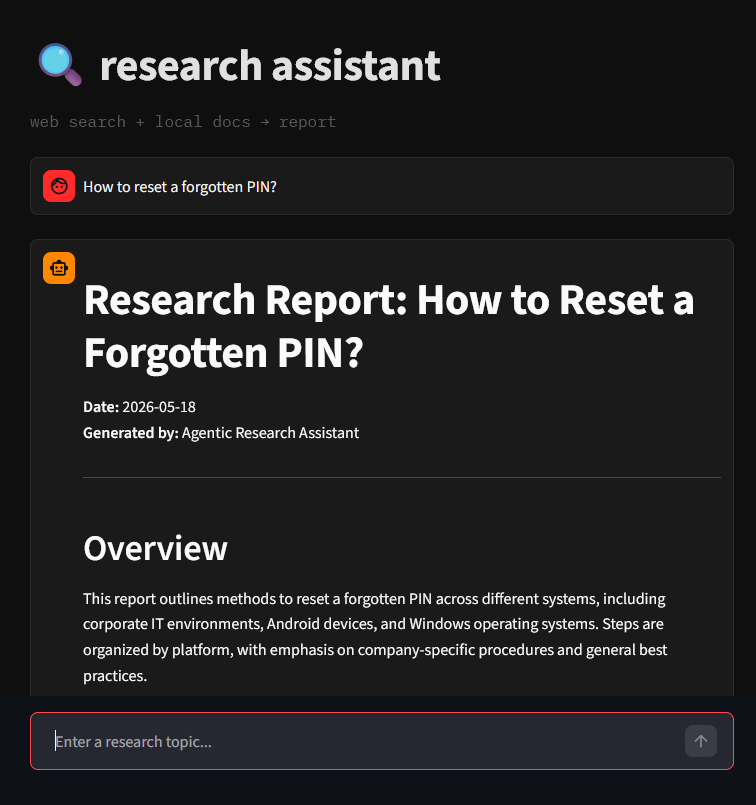
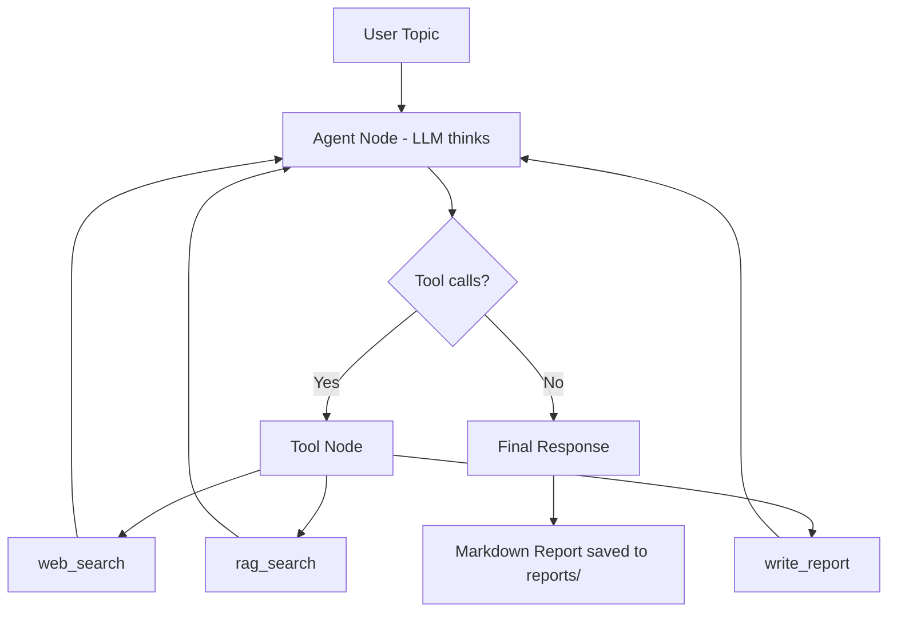

# Agentic Research Assistant

## Demo


---

## Overview
This project implements an **agentic research assistant** powered by a local LLM. Given a research topic, the agent autonomously decides which tools to use — searching the web, querying a local knowledge base, and writing a structured markdown report. The agent is built with LangGraph, which manages the decision loop, tool calls, and state across multiple steps.

Unlike a simple RAG pipeline, the agent decides on its own when to search, how many times, and which tools are relevant — making it a true LLM-driven agent rather than a fixed pipeline.

### Dataset
The local knowledge base uses the Synthetic IT Helpdesk Knowledge Base dataset from Kaggle:

https://www.kaggle.com/datasets/dkhundley/synthetic-it-related-knowledge-items

The dataset contains IT support knowledge articles in CSV format, with fields such as:
- `ki_topic`: the topic of the issue
- `ki_text`: the main knowledge base content
- `alt_ki_text`: alternative phrasing of the same content
- `bad_ki_text`: poorly written or noisy versions of the content

### Purpose
- Build an end-to-end agentic system using LangGraph
- Demonstrate tool calling, agent state management, and RAG integration
- Run entirely locally with no paid APIs

---

## Features
- LLM-driven agent loop — decides which tools to use and when
- Web search via DuckDuckGo (no API key required)
- Local RAG using FAISS and Sentence Transformers
- Automatic markdown report generation saved to disk
- Streamlit chatbot UI
- CLI entry point for terminal use

---

## Tech Stack

- **Language:** Python
- **LLM:** Qwen3:8b (via Ollama, runs locally)
- **Agent Orchestration:** LangGraph
- **Embeddings:** Sentence Transformers (`Qwen3-Embedding-0.6B`)
- **Vector Database:** FAISS
- **Web Search:** DuckDuckGo (`ddgs`)
- **Frontend/UI:** Streamlit

---

## Architecture

The agent follows a loop where the LLM decides what to do at each step:



### Project Structure

```
agentic_research_assistant/
├── agent/
│   ├── graph.py        # LangGraph agent loop
│   └── state.py        # shared agent state
├── tools/
│   ├── web_search.py   # DuckDuckGo search tool
│   ├── rag_tool.py     # FAISS document retrieval tool
│   └── report_writer.py # saves output as markdown report
├── rag/
│   ├── ingest.py       # load docs into FAISS
│   └── retriever.py    # embed and query documents
├── docs/               # drop PDFs or CSVs here for RAG
├── reports/            # agent saves generated reports here
├── app.py          # Streamlit interface
├── main.py             # CLI entry point
├── .env.example        # public config template
└── requirements.txt
```

---

## How to Run

### 1. Install dependencies
```bash
pip install -r requirements.txt
```

### 2. Start Ollama
```bash
ollama serve
ollama pull qwen3:8b
```

### 3. Build the RAG index
Drop your documents into the `docs/` folder, then run:
```bash
python -m rag.ingest
```

### 4. Run the Streamlit UI
```bash
cd agentic_research_assistant
streamlit run app.py
```

### 5. Or run from the terminal
```bash
python main.py "How do I troubleshoot a VPN connection issue?"
```

---

## How It Works

1. User enters a research topic
2. The LLM reads the topic and decides which tools to call
3. `web_search` fetches results from DuckDuckGo
4. `rag_search` retrieves relevant chunks from the local knowledge base
5. The LLM synthesizes the results and calls `write_report`
6. A markdown report is saved to `reports/` and the summary is returned to the user

---

## Future Improvements
- Add conversation memory across sessions
- Support PDF ingestion for RAG
- Add streaming response to the UI
- Implement evaluation metrics for retrieval quality
- Deploy as a web application
